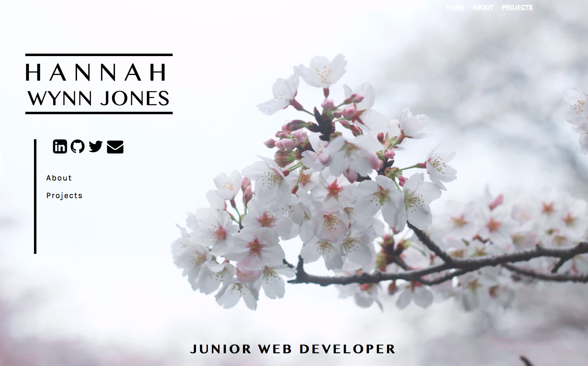
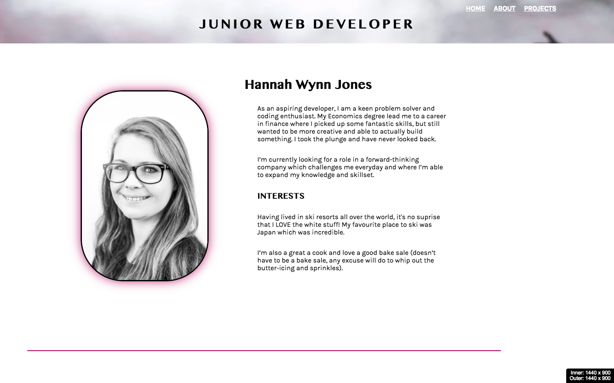
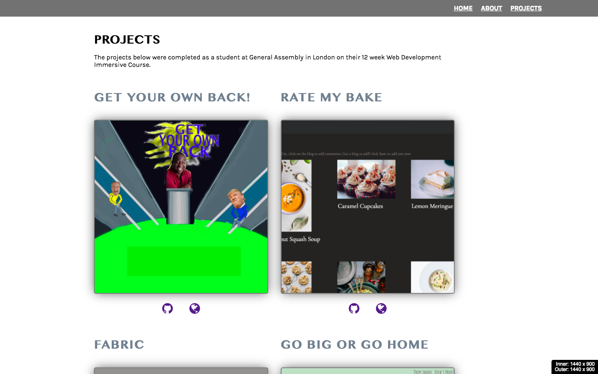

# Basic one page portfolio website

## www.hannahwynnjones.com

#### Approach / How it works

I wanted to create a smart simple design which has links to my projects that I created while on the Web Development Immersive course at General Assembly in London.

## My Blog

I've also developed a Blog site which was supposed to be connected to this site under the same domain.  This works on Local Host but hasn't been deployed yet, the code can be viewed at https://github.com/hannahwynnjones/hwj-website.  This MEAN stack app lets me login and add both blogs to the site and also projects (like the 4 developed at General Assembly), these have full CRUD capabilities.

#### The build

* HTML 5, CSS and jQuery were used to create this page.

#### Installation

www.hannahwynnjones.com

Github: https://github.com/hannahwynnjones/basic-web-page

Once forked, use command `npm i` and `nodemon` to run on local host.

